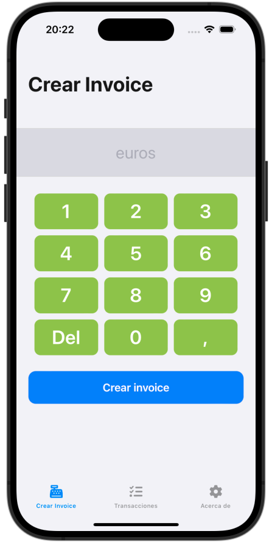
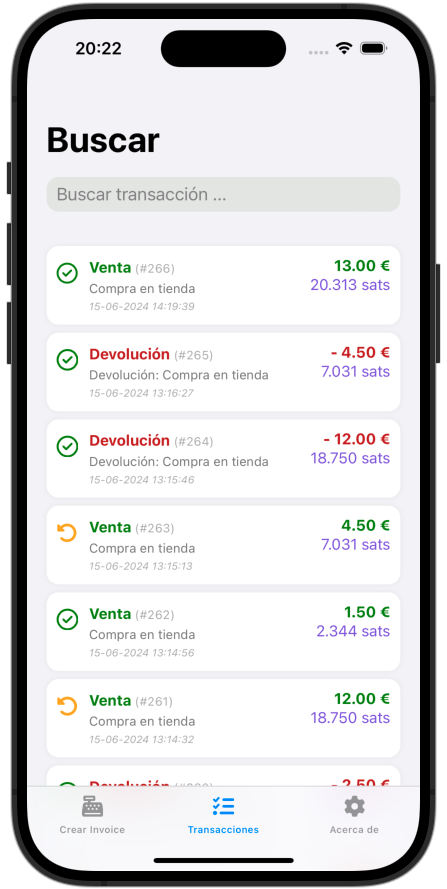
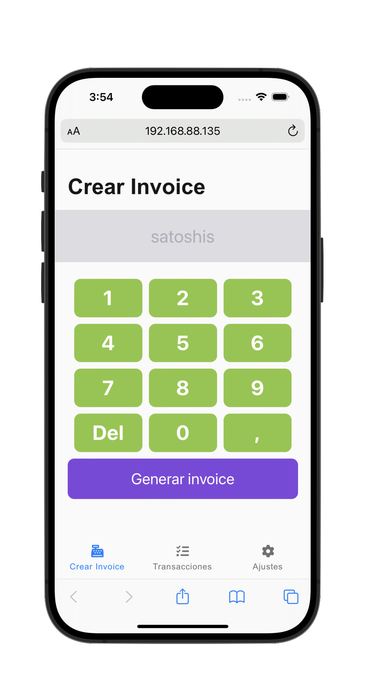

# UMA-Clovr PoS (”punto de venta”)

<div style="text-align: center; width: 100%; padding: 0 auto;">
   &nbsp;&nbsp;&nbsp;&nbsp;&nbsp; &nbsp;&nbsp;&nbsp;&nbsp;&nbsp; 
</div>

## Acerca de la aplicación PoS ("punto de venta")

Este proyecto ha sido desarrollado por Ana Gil Orozco, Hector Guzmán Arroyo e Ignacio Caballero Peñalver. La aplicación PoS es una plataforma que permite la creación de facturas y la gestión de transacciones de un punto de venta, como un comercio tradicional.

La característica más destacada de esta aplicación es la capacidad de realizar pagos y cobros a través de la red Bitcoin Lightning ⚡. Esta tecnología permite transacciones rápidas y de bajo costo en la red Bitcoin.

Gracias a esta funcionalidad, los comercios pueden diversificar sus métodos de pago aceptando Bitcoin, ofreciendo una opción más a sus clientes y potencialmente atrayendo a una nueva audiencia de usuarios de criptomonedas.

## Estructura del proyecto

El proyecto está dividido en varias secciones que facilitan su creación y funcionamiento. Estas partes son: backend, frontend y otros recursos necesarios.

- **Backend**: Ha sido desarrollado utilizando el lenguaje de programación GOLANG.
- **Frontend**: Se ha desarrollado utilizando lenguajes web como HTML5, CSS3 y JavaScript.

Además, existe un backend adicional que asiste al frontend y actúa como servidor de Eventos Enviados por el Servidor (Server-Sent Events, SSE). De esta manera, el frontend que se ejecuta en el iPhone puede comunicarse con el frontend que se ejecuta en el iPad. A continuación, se explicará el funcionamiento de la aplicación en iPhone y iPad.

## Recursos adicionales necesarios

Para el desarrollo del proyecto, se han utilizado recursos adicionales como la aplicación Polar Lightning, que ha permitido crear la infraestructura de nodos en la regtest. Además, se ha creado un contenedor docker que ejecuta un servidor de base de datos PostgreSQL donde se almacenan las transacciones, sus datos y sus estados.

Es necesario también un servidor web para ejecutar la aplicación en el caso de que se haga usando un navegador como Safari o como PWA en un dispositivo móvil. En el caso de la ejecución del "monitor" en un iPad, también es imprescindible el uso de un servidor web. El servidor web y todas las comunicaciones deben ser usando certificados de clave pública y privada TLS. Todas las comunicaciones entre frontend y backend se realizan de manera cifrada con TLS. Es requisito imprescindible para el correcto funcionamiento como PWA y la implementación de seguridad del proyecto.

## 🚀 Puesta en marcha del proyecto

En cada carpeta de este repositorio, hay archivos README 📝 que explican cómo iniciar cada parte del proyecto. Es crucial revisar estos documentos para entender cómo instalar y configurar correctamente la aplicación PoS. También es muy importante hacerlo en el orden que se indica, comenzando con la siguiente sección de **Requisitos y Configuración**.

Sigue el siguiente orden de ejecución de las distintas partes del proyecto:
1. El proyecto se ha desarrollado en "local" con la dirección IP 192.168.88.135. Es importante, para un correcto funcionamiento, replicar las condiciones del desarrollo (podrás modificar estos valores según sea necesario más adelante).
2. Instala los requisitos y Configuración (siguiente apartado)
3. Accede al directorio ***docker*** y ejecuta ```docker-compose up``` para crear el servidor de base de datos PostgreSQL.
4. Continúa en el directorio ***backend*** y ejecuta la aplicación GO ```go run main.go``` (Tienes algunos detalles adicionales en el Readme de la carpeta *backend*).
5. Finalmente, lanza un servidor web utilizando los archivos html y demás recursos que se encuentran dentro de la carpeta ***frontend/web***. **Es importante que leas el Readme del directorio *frontend* **.

## 🛠️ Requisitos y Configuración

El primer requisito para la puesta en marcha es tener instalado **Docker Desktop** para poder ejecutar **Polar Lightning**. En este directorio del repositorio, hay un archivo llamado **UMA-Clovr-PoS.polar.zip** que contiene la configuración a cargar en **Polar Lightning** y que se usará para la puesta en marcha.

Instalación de **Docker Desktop**

> https://www.docker.com/products/docker-desktop/
 
Instalación de **Polar Lightning**

> [https://lightningpolar.com](https://lightningpolar.com/)

Ejecutar **Polar Lightning** e importar el archivo de configuración **UMA-Clovr-PoS.polar.zip**


## 📱 Funcionamiento de la aplicación en iPhone e iPad

El funcionamiento principal de la aplicación se ha basado en el uso de un iPhone y un iPad. En este caso, el iPhone 📱 ejecuta una versión de la aplicación (puede ejecutarse desde safari, usando PWA como Webclip, o incluso embeber todo el proyecto en una aplicación nativa usando Cordova para iOS). Por otro lado, el iPad, y para una mejor visibilidad, ejecuta una versión PWA del archivo client.php.

El iPhone 📱 es el que ejecuta la versión del PoS (punto de venta) y es capaz de realizar las siguientes tareas:

- Crear invoice 💰.
- Listar transacciones (ventas, devoluciones) 📝.
- De las transacciones realizadas, puede realizar abonos usando Bitcoin Lightning Network ⚡💸.

Por otro lado, el iPad funciona como "monitor". En el contexto de un comercio físico, este sería una pantalla donde el cliente puede ver el importe de su compra 💵 y el código QR que tendría que escanear con su billetera para realizar el pago solicitado por el PoS que previamente ha introducido y ha creado el invoice correspondiente 🧾.