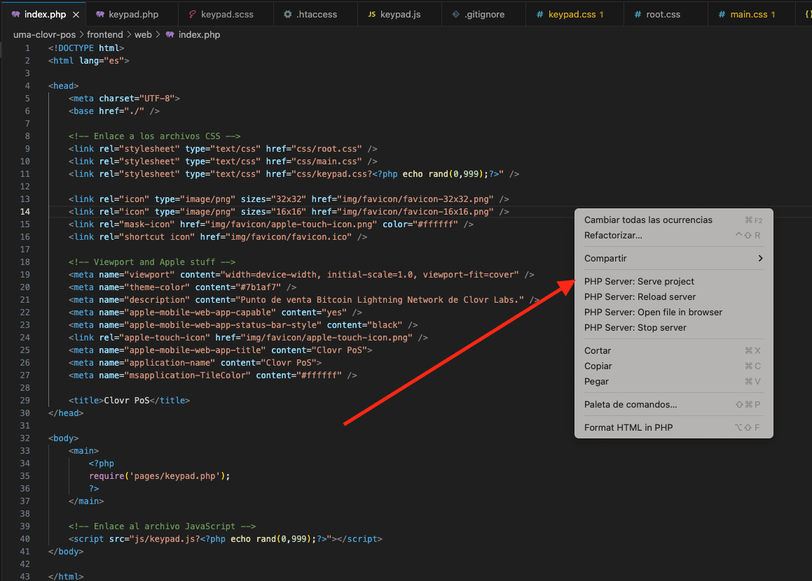
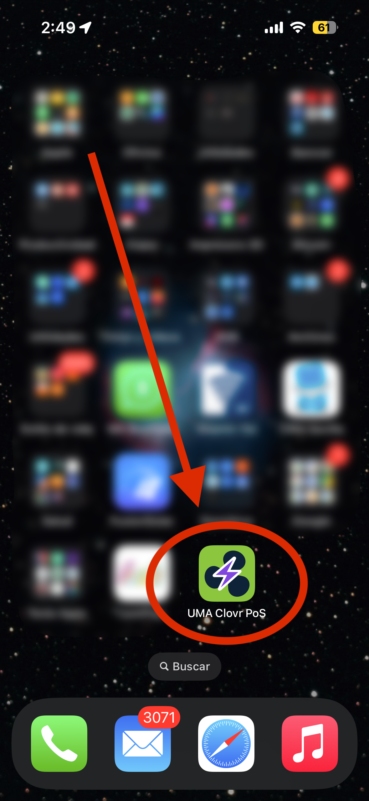
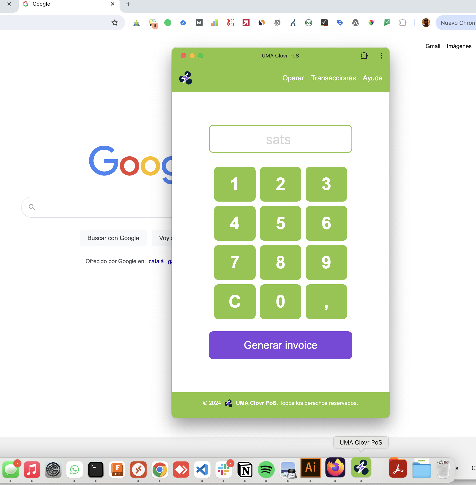

# UMA Clovr PoS [FrontEnd]

Interface de usuario usada como FrontEnd para la emisión de facturas y devoluciones a través de la red Bitcoin Lightning.

## Clonar el repositorio en local

1. Utilizando VS Code, clonar el repositorio en una carpeta local o copiar los archivos del repositorio y colocarlos en la carpeta local del proyecto.

   `https://github.com/markettes/uma-clovr-pos.git`

## Configuración del entorno de ejecución en local

### 1. Usando ___VS Code___

Instrucciones para la ejecución del frontend en local usando exclusivamente Visual Studio Code en un equipo que corre sistema operativo MacOS (en un futuro próximo presentaré la versión para Windows cuando avance con el proyecto).

1. Instalar PHP en la máquina. En el caso de macOS puedes usar __brew__.

   `brew install php`
   
2. Instalar la extensión de VSCode __"PHP Server"__ _(creada por brapifra)_.
3. Para ejecutar el archivo __index.php__ desde VSCode, hacer clic con el __botón derecho__ en cualquier zona del código de __index.php__ y ejecutar ___"PHP Server: Serve project"___.

   

### 2. Usando XAMPP (___imprescindible y necesario para usar la versión alternativa PWA con service-worker___)

1. Instalar XAMPP descargándolo desde la web del desarrollador.

   > https://www.apachefriends.org/es/download.html

2. Clonar el contenido de la carpeta web del repositorio dentro de __"/Applications/XAMPP/xamppfiles/htdocs"__

3. Acceder a la web mediante https://localhost _(aceptar el certificado autofirmado)_

## Uso de la aplicación web

Esta webApp puede ser ejecutada en cualquier navegador web. Está preparada para ser instalada como PWA en cualquier dispositivo que lo soporte (Android, iOS, Mac, ...). Es solo un primer ejemplo de interface. 
La versión móvil tendrá el menú en el inferior como la mayoría de aplicaciones nativas.

   &nbsp;&nbsp;&nbsp;&nbsp;&nbsp;&nbsp;

   

 
