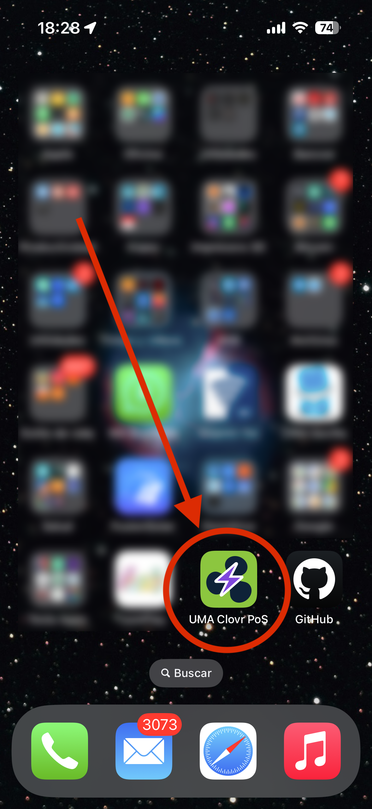
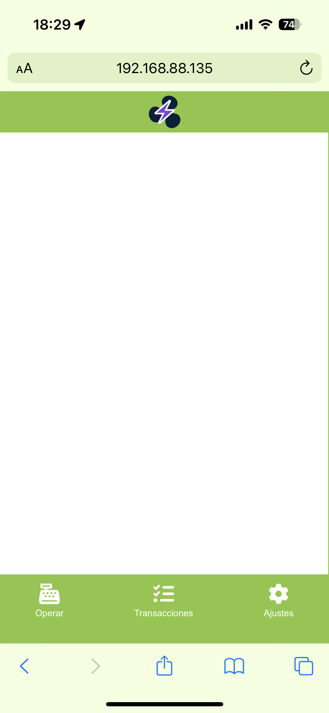
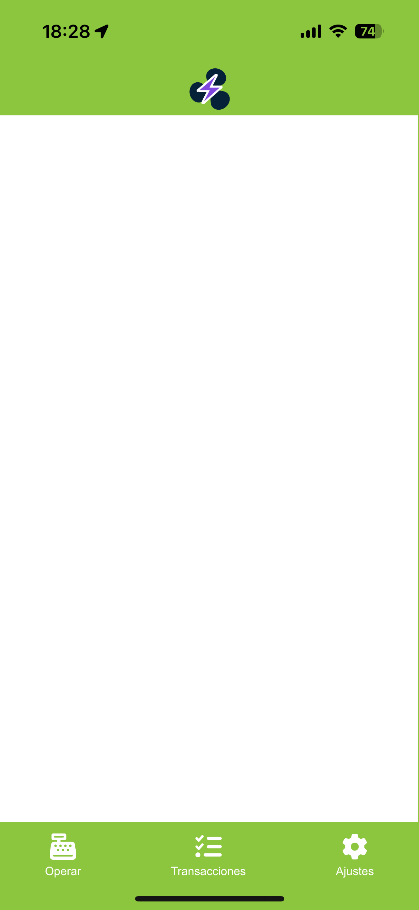

# UMA Clovr PoS [FrontEnd]

Interface de usuario usada como FrontEnd para la emisión de facturas y devoluciones a través de la red Bitcoin Lightning.

## Clonar el repositorio en local

1. Utilizando VS Code, clonar el repositorio en una carpeta local o copiar los archivos del repositorio y colocarlos en la carpeta local del proyecto.

    `https://github.com/markettes/uma-clovr-pos.git`

## Configuración del entorno de ejecución en local

### 1. Usando **_VS Code_** _(permite usar la webApp como web clip)_

Instrucciones para la ejecución del frontend en local usando exclusivamente Visual Studio Code en un equipo que corre sistema operativo MacOS (en un futuro próximo presentaré la versión para Windows cuando avance con el proyecto).

1. Instalar PHP en la máquina. En el caso de macOS puedes usar **brew**.

    `brew install php`

2. Instalar la extensión de VSCode **"PHP Server"** _(creada por brapifra)_.
3. Para ejecutar el archivo **index.php** desde VSCode, hacer clic con el **botón derecho** en cualquier zona del código de **index.php** y ejecutar **_"PHP Server: Serve project"_**.

    

    
    

### 2. Usando XAMPP (**_imprescindible y necesario si se desea usar la versión alternativa PWA con service-worker_ offline**)

1. Instalar XAMPP descargándolo desde la web del desarrollador.

    > https://www.apachefriends.org/es/download.html

2. Clonar el contenido de la carpeta web del repositorio dentro de **"/Applications/XAMPP/xamppfiles/htdocs"**

3. Acceder a la web mediante https://localhost _(aceptar el certificado autofirmado)_

## Uso de la aplicación web (Navegador y __PWA__)

Esta webApp puede ser ejecutada en cualquier navegador web. Está preparada para ser instalada como __PWA__ en cualquier dispositivo que lo soporte (Android, iOS, Mac, ...). Es solo un primer ejemplo de interface.
La versión móvil tendrá el menú en el inferior como la mayoría de aplicaciones nativas y será capaz de mostrarse de manera offline. Queda fuera del alcance de este proyecto la realización de una PWA capaz de trabajar full offline y almacenar operaciones en caso de no tener conexión a internet para "lanzarlas" una vez recupere la conexión.

     

     

